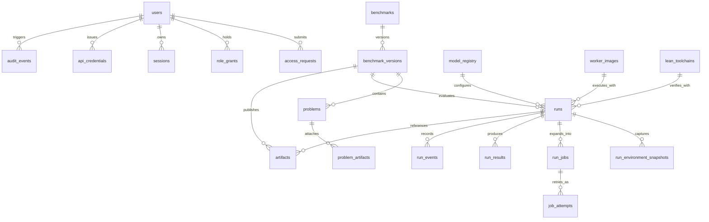

# Data Baseline

The MVP data model is centered on a small number of relational concerns. The database needs to represent people, access state, benchmarks, runs, artifacts, reproducibility metadata, and audit history without pretending that every downstream workflow has already been implemented. The point of the baseline is to establish which concepts belong in Postgres before table-by-table work begins.

The core entity groups are straightforward. Auth and access state include users, linked identities, access requests with review metadata, role grants, sessions, and later API credentials. Benchmark state includes benchmarks, benchmark versions, problems, and problem-linked artifacts. Execution state includes runs, run jobs, job attempts, run events, and results. Reproducibility state includes model registry entries, worker image references, Lean toolchain identifiers, and run environment snapshots. Artifact metadata stays in Postgres as references, checksums, media types, ownership, and retention fields rather than as blob content. Audit state records privileged actions and important system transitions.

The first schema cut should keep those groups explicit instead of collapsing them into a few overloaded tables. The table names below are the intended first-pass shape, not a promise that every column is already decided.

The Neon branch strategy should stay equally boring. Production uses a main branch. Staging uses a staging branch. Local development should default to local Postgres and only use Neon when parity with the hosted environment is useful. Temporary Neon branches are allowed for focused debugging, risky schema work, or shared review environments, but the project must never create a branch per run or a project per run. Neon is part of the environment model, not part of the benchmark bookkeeping model.

That branch strategy implies a simple credential model. The API runtime should use one stable application credential per hosted environment branch, and that credential should be limited to the normal application schema operations the Fastify backend needs for reads, inserts, updates, and deletes. Schema changes, ownership changes, and extension-level operations belong to a separate migration credential that is only used by migration tooling and deployment workflows. A read-only credential can exist later for safe operational inspection or reporting, but it should not be part of the normal application path and it should never be the same credential used by migrations.

Local development follows a different rule on purpose. Contributors should default to a local Postgres instance with local credentials. When Neon parity is needed, that access should point to an isolated development branch with a narrowly scoped branch-specific credential instead of any shared production secret. The backend does not treat Cloudflare Access as direct database authentication; Access controls who may reach protected application surfaces, and the Railway-hosted backend then uses its own runtime database credential to talk to Neon. That keeps browser identity, application authorization, and database authorization cleanly separated.
